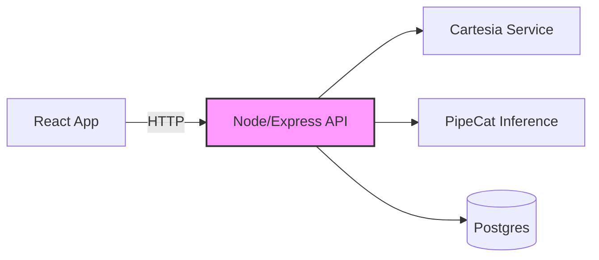

# Voice-Cloning MVP – Technical PRD

---

## 1. Overview & Goals
Clone a user's voice from a 5–10 s sample and render arbitrary text in that voice—delivered via a simple web UI. Leverage Cartesia for preprocessing, PipeCat for inference. Ship a single mono-repo with React front-end, Node/Express API, and minimal infra configs.

---

## 2. Key Features
- **Voice Sample Upload** – Accept WAV/MP3; validate length & format.  
- **Preprocessing** – Run Cartesia noise suppression & normalization.  
- **TTS Inference** – Send preprocessed audio + text to PipeCat; return synthesized voice.  
- **Playback & Download** – Stream audio in-browser; allow download of WAV.

---

## 3. Primary Use Cases
- **Demo Flow**  
  - *Actor*: First-time visitor  
  - *Success*: Upload sample → enter text → hear cloned voice within 30 s  
- **Error Handling**  
  - *Actor*: Any user  
  - *Success*: Show clear error ("sample too short," "inference failed") with retry option  

---

## 4. End-to-End User Flow
1. **Landing Page** – "Upload your voice" widget.  
2. **Upload** – User selects file; front-end POSTs to `/api/voice-samples`.  
3. **Preprocess** – Backend runs Cartesia; update sample `status` in DB.  
4. **Sample Ready** – Front-end polls `/api/voice-samples/:id/status`.  
5. **Text Input** – User types text; POST to `/api/clone`.  
6. **Inference** – Backend calls PipeCat.  
7. **Result Ready** – Front-end polls `/api/clone/:jobId/status`.  
8. **Playback** – Display audio player; download link.

---

## 5. System Architecture Diagram


---

## 6. Data Flow & Storage

### Schemas (Postgres)

```sql
CREATE TABLE voice_samples (
  id UUID PRIMARY KEY,
  user_id UUID,
  file_url TEXT,
  status TEXT,          -- "pending"|"processing"|"ready"|"failed"
  created_at TIMESTAMP
);

CREATE TABLE clones (
  job_id UUID PRIMARY KEY,
  sample_id UUID REFERENCES voice_samples,
  input_text TEXT,
  audio_url TEXT,
  status TEXT,          -- "queued"|"succeeded"|"failed"
  created_at TIMESTAMP
);
```

### Lifecycle
- Upload → insert voice_samples(status=pending)
- Cartesia runs → update status=ready
- Clone request → insert clones(status=queued)
- PipeCat → update clones(status=succeeded)

---

## 7. API Contracts

### Upload Sample
- POST /api/v1/voice-samples
- Body: { userId, file: File }
- → 202 Accepted { sampleId }

### Check Sample Status
- GET /api/v1/voice-samples/:sampleId/status
- → 200 { status }

### Request Clone
- POST /api/v1/clone
- Body: { sampleId, text }
- → 202 Accepted { jobId }

### Check Clone Status
- GET /api/v1/clone/:jobId/status
- → 200 { status }

### Fetch Result
- GET /api/v1/clone/:jobId/result
- → 200 { audioUrl }

---

## 8. Edge Cases & Failure Handling
- Invalid Format – Reject non-WAV/MP3 → return 400.
- Sample Too Short – < 3 s → return "sample too short."
- Cartesia Timeout – Retry once, then mark sample failed.
- PipeCat Failure – Log error; return user "inference failed."
- DB Outage – Return 503; instruct user to retry.

---

## 9. Mono-Repo Structure

```
/ (root, Turborepo)
├── apps/
│   ├── frontend/        # React + Vite
│   └── backend/         # Node/Express
├── packages/
│   ├── shared-types/    # TS interfaces
│   └── config/          # ESLint, Prettier, env schemas
├── docker-compose.yml
└── .github/
    └── workflows/ci.yml
```

- Build Tool: Turborepo
- Lint/Test: npm run lint, npm run test in each app
- CI: GitHub Actions → run lint/test → build Docker images

---

## 10. Deployment Plan
- Containers: Dockerfile per app
- Environments:
  - Staging: NODE_ENV=staging, CARTESIA_KEY, PIPECAT_URL, DB_URL
  - Production: same vars with production values
- Orchestration:
  - Kubernetes manifests or Docker Compose for MVP
  - CI → build & push images → deploy via kubectl apply

---

## 11. Security & Privacy Considerations
- User Consent: Explicit checkbox before sample upload
- Encryption: HTTPS in transit; at-rest encryption for audio in S3/Postgres
- Access Control: JWT auth for all endpoints
- Data Retention: Auto-delete samples after 30 days or on user request
- PII: Store only URLs & metadata; no raw PII in DB

---

## 12. Open Questions & Assumptions
- Sample Length: Assume ≥ 5 s yields acceptable quality
- Training Time: Use on-the-fly inference—no long model fine-tune
- Concurrency: Target ≤ 50 simultaneous jobs for MVP
- Auth: MVP uses simple email+magic link; plan OAuth later

---

**Note:** Avatar Preview feature has been moved to Phase 2 (removed from MVP scope).
